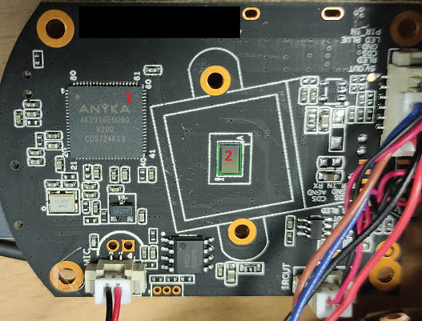
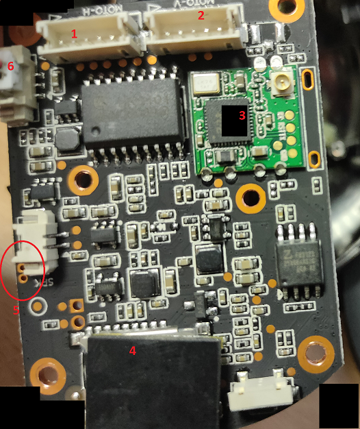
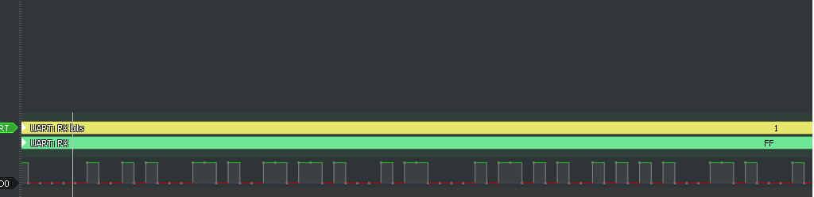
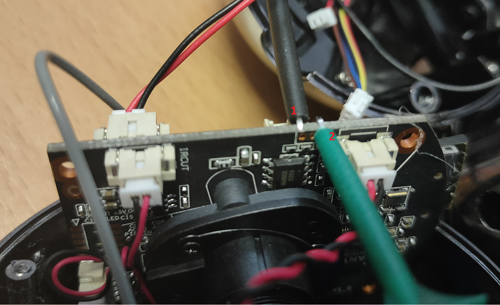

# Notes on a Yoosee Robot Camera

I had recently the chance to analyse a camera, build into a neat robot shell.
The device comes with a short descritopn howto integrate and connect to the
device. After setting it up and watching the network traffic, i was interested
in digging a bit deeper.

## Revision and Contact

  * Revision: 0.1
  * Contact me at: dash@undisclose.de
  * You can also catch me at #nullsecurity.net:matrix.org

## General

The robot is able to turn its head up, down, left and right. This can be done
manual or with head-tracking enabled. Installing an android or ios application
allows pairing and controling it. Also storing videostreams on a SDCard and in
a cloud storage is possible.

As the device can be controlled remotely it is clear, that there is
communication over the internet and/or the local network available. Looking at
the network traffic that time, most of it is based on UDP.

What also surprised me, was that the camera was still working when the visor
is down covering the lense.

## Hardware

After tinkering with the android application, i decided to take a look at the
internals of the device.

Numbers in Red:

  1. Anyka CPU/SoC(System on Chip) - AK3918EV200
  2. Place of the camera lense itself before removed

The used SoC is especially built for IP Cameras. It is the believe of the
author that this Chip (further revisions), as well as the PCB are massivly
used in cheap chinese surveillance cameras.

All in all, the whole device was a bit more omplex as i assumed. It had two
motors, one for turning the head up and down, one for turning it from left to
the right.

Numbers:

  1. Motor for movement of the head
  2. Motor for movement of the head
  3. Wifi Card
  4. Slot for SDCard
  5. Reference for Chapter "Getting a shell"
  6. Power

On the back of the robot-shelf is a micro-usb connector, however it only
supports power and non-conductor. The `RX` and `TX` slot are unused. Only
Ground and Volts.

### Getting a shell

On the mainboard of the device are three small holes close to the connector of
the speaker(Remember Number 5 of second picture?). As it turned out by basic
testing with a cheap logic analyser, data was sent through it.

For this you can use the linked analyser in the appendix and use the software
from `saleae` or better the open source variant `sigrok`.

For attaching at chips or holes at boards i used hook clips. They are quite
cheap and do their work.

Numbers:

  1. TX wire (left clip)
  2. RX wire (right clip)

Some more testing revealed that with a TTL converter connected to the USB port
the `tty` of the device can be accessed. With 115200 baud.

After successful connection i was greeted with `uboot` a free bootloader.

    
    
    U-Boot 2013.10.0-AK_V2.0.04 (Apr 08 2021 - 12:40:06)
    
    DRAM:  64 MiB
    8 MiB
    Create flash partition table init OK!
    ANYKA SDHC/MMC4.0: 0
    Load Env CRC OK!
    In:    serial
    Out:   serial
    Err:   serial
    Net:   AKEthernet-0
    
    Hit any key to stop autoboot:  1                                                                                                                                   0 
    anyka#

As access to the bootmanager is possible as well, parts of the filesystem,
memory and the bootloader can be read and written. Also booting a different
device would be possible. But i'am more interested to figure if the OS can be
accessed, whats happening after the boot.

    
    
       Booting kernel from Legacy Image at 81808000 ...
       Image Name:   Linux-3.4.35
       Image Type:   ARM Linux Kernel Image (uncompressed)
       Data Size:    1329632 Bytes = 1.3 MiB
       Load Address: 81808000
       Entry Point:  81808040
       Verifying Checksum ... OK
       XIP Kernel Image ... OK
    
    Anyka Linux Kernel Version: 2.5.05
    
    Linux version 3.4.35 (root@linux-compiler1) (gcc version 4.8.5 (anyka (gcc-4.8.5 + binutils-2.24 + ulcibc-0.9.33.2)(20170223)) ) #41 Thu Jun 3 21:28:02 CST 2021
    CPU: ARM926EJ-S [41069265] revision 5 (ARMv5TEJ), cr=00053177
    CPU: VIVT data cache, VIVT instruction cache
    Machine: AK3918EV200_GWELL_V1
    
    Kernel command line: console=ttySAK0,115200n8 root=/dev/mtdblock4 rootfstype=squashfs init=/sbin/init mem=64M memsize=64M

Luckily there was no password set on the device, so a root login was achieved
in the next step.

As the main application, called `ipc` is littering the screen with endless
debug messages and no network access was available yet, i decided to give me a
network shell. The developers of the device have left a telnet daemon for our
convinience.

`telnetd &`

## Network Activity

IP Information after joined wireless network of camera:    
    
    10.200.226.100 -- Client in Robot Network  
    10.200.226.1 -- Robot dhcp  

Note:

There is port 5000/tcp (soap) and 554/tcp (rtsp) open.  

Asks for the following dns servers

    
    
    Host 184.181.43.121.in-addr.arpa. not found: 3(NXDOMAIN)
    5.5.5.223.in-addr.arpa domain name pointer public1.alidns.com.
    Host 247.77.91.47.in-addr.arpa. not found: 3(NXDOMAIN)
    114.114.114.114.in-addr.arpa domain name pointer public1.114dns.com.

Some servers the unit is connecting too:

    
    
    p2pu_start_process_query_dns_v2
    [msg] Nameserver 8.8.8.8:53 has failed: Network is unreachable
    p2pu_start_process_query_dns_v2: evdns_getaddrinfo( p2p1.cloudlinks.cn )
    [msg] Nameserver 114.114.114.114:53 has failed: Network is unreachable
    p2pu_start_process_query_dns_v2: evdns_getaddrinfo( p2p4.cloud-links.net )
    [msg] Nameserver 223.5.5.5:53 has failed: Network is unreachable
    [msg] All nameservers have failed
    p2pu_start_process_query_dns_v2: evdns_getaddrinfo( p2p2.cloudlinks.cn )
    p2pu_start_process_query_dns_v2: evdns_getaddrinfo( p2p3.cloud-links.net )
    p2pu_start_process_query_dns_v2: evdns_getaddrinfo( p2p5.cloudlinks.cn )
    p2pu_start_process_query_dns_v2: evdns_getaddrinfo( p2p6.cloudlinks.cn )
    p2pu_start_process_query_dns_v2: evdns_getaddrinfo( p2p7.cloudlinks.cn )
    p2pu_start_process_query_dns_v2: evdns_getaddrinfo( p2p8.cloudlinks.cn )
    p2pu_start_process_query_dns_v2: evdns_getaddrinfo( p2p9.cloudlinks.cn )
    p2pu_start_process_query_dns_v2: evdns_getaddrinfo( p2p10.cloudlinks.cn )

### Dumping the Filesystem

Funnily enough, during my research i found some few people also working on
this, some years ago, but one right now: t-rekt. T-Rekt published a dump of
the filesystem, and if i interpreted the code correctly also an unpacker for
the "encrypted" firmware downloaded from the cloudservice. I have not furhter
investigated the work but you might be interested to have a look.

For getting an idea what we are up against, i like to download the files of
devices. Again, the developer/s of the device made our task easy. There is
`netcat` which supports us in sending data through the net.

Camera side:

    
    
    # nc -v 10.1.1.1 9999 | tar vf -

Notebook Side:

    
    
    # nc -v -l -p9999 > fs.tar

As soon it is done we can unpack it and start investigating the downloaded
files.

### Telnet Shell

    
    
    [root@anyka ~]$ ls
    bin   dev   etc   init  ipc   lib   mnt   proc  rom   sbin  sys   tmp   usr   var
    [root@anyka ~]$ uname -a
    Linux anyka 3.4.35 #41 Thu Jun 3 21:28:02 CST 2021 armv5tejl GNU/Linux
    [root@anyka ~]$ id
    uid=0(root) gid=0(root) groups=0(root)
    [root@anyka ~]$

### Local Live Analysis

    
    
    Active Internet connections (servers and established)
    Proto Recv-Q Send-Q Local Address           Foreign Address         State       PID/Program name    
    tcp        0      0 0.0.0.0:5000            0.0.0.0:*               LISTEN      427/ipc
    tcp        0      0 0.0.0.0:554             0.0.0.0:*               LISTEN      427/ipc
    tcp        0      0 0.0.0.0:23              0.0.0.0:*               LISTEN      578/telnetd
    tcp        0      1 10.x.x.x:35544         47.91.77.247:51701      SYN_SENT    427/ipc
    tcp        0      0 10.x.x.x:23            10.x.x.x:58140         ESTABLISHED 578/telnetd
    tcp        0  65160 10.x.x.x:49670         10.x.x.x:8787          ESTABLISHED 7269/nc
    tcp        0    171 10.x.x.x:23            10.x.x.x:41320         ESTABLISHED 578/telnetd
    udp        0      0 0.0.0.0:51463           0.0.0.0:*                           427/ipc
    udp        0      0 0.0.0.0:38922           0.0.0.0:*                           427/ipc
    udp        0      0 0.0.0.0:3702            0.0.0.0:*                           427/ipc
    udp        0      0 0.0.0.0:51109           0.0.0.0:*                           427/ipc
    udp        0      0 0.0.0.0:51880           0.0.0.0:*                           427/ipc
    udp        0      0 127.0.0.1:4278          0.0.0.0:*                           434/
    udp        0      0 127.0.0.1:4279          0.0.0.0:*                           427/ipc
    udp        0      0 0.0.0.0:8899            0.0.0.0:*                           427/ipc
    udp        0      0 0.0.0.0:60617           0.0.0.0:*                           427/ipc
    Active UNIX domain sockets (servers and established)
    Proto RefCnt Flags       Type       State         I-Node PID/Program name    Path
    unix  4      [ ]         DGRAM                       120 347/syslogd         /dev/log
    unix  2      [ ]         DGRAM                       213 483/wpa_supplicant  /etc/Wireless/wlan0
    unix  2      [ ]         DGRAM                       173 427/ipc

Password-File:

    
    
    [root@anyka /etc] cat passwd
    root:x:0:0:root:/:/bin/sh
    daemon:x:1:1:daemon:/usr/sbin:/bin/sh
    bin:x:2:2:bin:/bin:/bin/sh
    nobody:x:99:99:nobody:/home:/bin/sh

As root has no password set, there is also no password hash or alike in the
shadowing system.

    
    
    cat shadow
    root::0:0:99999:7:::
    bin:*:10933:0:99999:7:::
    daemon:*:10933:0:99999:7:::
    nobody:*:10933:0:99999:7:::
    
    
    [root@anyka /etc] cat wifi*
    cat wifi*
    bssid=xx.xx.xx.xx.xx.xx
    ssid=testnet
    id=0
    passphrase=vrysecure
    psk=ADDEADDE...
    mode=station
    pairwise_cipher=CCMP
    group_cipher=CCMP
    key_mgmt=WPA2-PSK
    wpa_state=COMPLETED
    ip_address=10.x.x.x.x
    address=xx.xx.xx.xx.xx.xx
    signal_level=169
    bssid / frequency / signal level / flags / ssid

Mounted filesystems:

    
    
    rootfs on / type rootfs (rw)
    /dev/root on / type squashfs (ro,relatime)
    devtmpfs on /dev type devtmpfs (rw,relatime,mode=0755)
    proc on /proc type proc (rw,relatime)
    tmpfs on /tmp type tmpfs (rw,relatime)
    tmpfs on /var type tmpfs (rw,relatime)
    devpts on /dev/pts type devpts (rw,relatime,mode=600,ptmxmode=000)
    tmpfs on /mnt type tmpfs (rw,relatime)
    sysfs on /sys type sysfs (rw,relatime)
    /dev/mtdblock6 on /rom type jffs2 (rw,relatime)
    tmpfs on /mnt/ramdisk type tmpfs (rw,relatime)
    tmpfs on /etc type tmpfs (rw,relatime)
    tmpfs on /tmp type tmpfs (rw,relatime)
    /dev/mtdblock5 on /ipc type squashfs (ro,relatime)
    /dev/mtdblock5 on /usr type squashfs (ro,relatime)

It should be also noted that, there are some additional modules to control the
motor. It is probably quite funny write a small remote app to control it.

## In Regard of Security

This includes just some quick notes and is the tip of the iceberg at its best.
Without doubt the robot has plenty of attacksurface available.

### No login password

Easy shell access if physical connection is made. Make no mistake, this just
made it even easier. With access to the bootloader, the devices can be
rewritten or read, which leads also to system access. However, giving not even
a password on a IOT device was to be past in my imagination.

### Wifi Credentials

Whatever network is configured, it will be printed as debug message during
runtime. This includes the network name and the password.

Example:

    
    
    [vInitNetSupportVal] fgEth0Support = 0,fgRa0Support = 1
    Init SSID=testnet , EncType=2, Password=vrysecure
    Init SSID=Free-AP1 , EncType=0, Password= 
    Init SSID=Free-AP2 , EncType=0, Password= 
    Init SSID=Free-AP3 , EncType=0, Password= 
    Init SSID=testnet , EncType=2, Password=vrysecure 
    [iParseWifiModuleType] wifi type: WIFI_TYPE_RDA5995

### Dataprivacy

It is the strong believe of the author, that such cameras should not be placed
in companies or other maybe even restricted environments. Even personal usage
is discouraged. All data ends up at chinese servers, opens up all sorts of
misuse.

### IPC Main Component

I took some hours sweeping through the assembly of the main-program. This and
additional software on the device leave the impression of selfmade encryption
and memory corruptions. I might publish a second piece of paper in future in
regard.

# Outro

This was a quick dive into accessing the device. Further research is necessary
to analyse the software running.

## Links

I have sorted links for additional research.

### Hardware

#### System on Chip

Later version of the chip:  
<https://www.unifore.net/ip-video-surveillance/anyka-ak3918ev300-1080p-ip-
camera-solution.html>

#### USB to TTL Serial

Those are just examples to get you going. You will find even cheaper ones.
Those have not been the ones i used. However, its the type of device you can
use to.

<https://www.amazon.com/Gumps-grocery-Module-Converter-Replace/dp/B081L482DP>  
<https://www.amazon.com/DGZZI-PL2303TA-Console-Serial-
Raspberry/dp/B07W42V16T/>  
<https://www.amazon.com/Adapter-Serial-Converter-Development-
Projects/dp/B075N82CDL>

#### Logic Analyser

This one i used for attaching to the different slots and holes and analyzing
the outcome.

<https://www.amazon.com/KeeYees-Analyzer-Device-Channel-Arduino/dp/B07K6HXDH1>

##### Software for Logic Analyzers

<https://www.saleae.com/downloads/>  
<https://sigrok.org/wiki/Main_Page>

### Repositories

<https://github.com/c0decave/yoosee-ipc> <https://github.com/t-rekttt/yoosee-
exploit>

### Product

Currently you can find it at ali express as robot camera.

